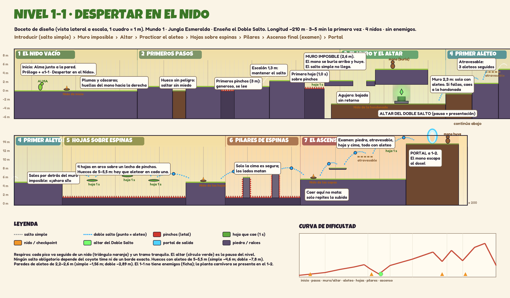

> **Estado (9 de octubre de 2026):** `Assets/Scenes/World_01/Level_1_1.unity` tiene el **recorrido completo montado en bloques** según el [boceto](Level_1_1_Boceto.png) (sección 6), probado jugando. Falta decorarlo con los [props del Mundo 1](../../LevelPieces/Decor_World1.md), el mono de presentación y el prólogo. La cámara usa tamaño ortográfico **8** y el juego no usa audio.

# 🗺️ Nivel 1-1: "Despertar en el Nido"
> **Mundo 1: Jungla Esmeralda** | **Función Pedagógica:** Introducir (Locomoción Base + Despertar del Doble Salto)

---

## 1. 📖 Sinopsis Narrativa & Contexto Emocional

- **Momento Narrativo:** Alma regresa a su nido tras buscar alimento en las lindes del bosque. El suelo tiembla ligeramente. Al llegar a la cuna de ramas, descubre el peor desenlace: el nido está completamente vacío y los cuatro huevos han desaparecido. En el suelo hay pequeñas pisadas simiescas que se internan hacia el corazón de la jungla.
- **Estado Emocional de Alma:** Silencio atónito, incredulidad inicial que rápidamente se transforma en una determinación maternal feroz e inquebrantable. No hay lágrimas; hay urgencia y concentración absoluta.
- **Textos en Pantalla / Banners:**
  - *Prólogo Inicial (Cámara lenta sobre el nido vacío):*
    > *"La tierra tembló una sola vez.*  
    > *Cuando regresé al nido con comida, el silencio era absoluto. No estaban.*  
    > *Si tengo que cruzar el continente entero a pie, mis pequeños volverán a sentir el calor de mis plumas."*
  - *Altar de la Gema Materna (Interacción):*
    > *"¡HABILIDAD DESPERTADA: ALETEO MATERNO!*  
    > *El latido de tus hijos resuena en tu sangre. Pulsa SALTO en el aire para desplegar tus plumas y ejecutar un segundo impulso."*
- **Pistas Narrativas en el Entorno:** Ramitas quebradas, plumas desgarradas de Alma caídas en la lucha, cáscaras vacías de bayas dejadas por los ladrones y huellas pequeñas que marcan el rumbo hacia la derecha.

---

## 2. 🎨 Dirección de Arte & Atmósfera Visual

- **Temática Visual:** Amanecer dorado en el sotobosque tropical. Raíces milenarias cubiertas de musgo húmedo, helechos gigantescos y motas de polen flotando en haces de luz cálida que atraviesan las copas.
- **Paleta de Color Principal:**
  - Cielo / Luz cenital: Oro pálido (`#F5E6A3`) y ámbar suave (`#D9A05B`).
  - Suelo y Vegetación: Verde bosque profundo (`#244023`), musgo esmeralda (`#4E7A38`) y corteza tierra húmeda (`#4A3319`).
  - Acentos de Interacción: Esmeralda brillante (`#00FF88`) para la Gema Materna y el portal de salida.
- **Fondo parallax (2 capas):**
  - *Fondo lejano:* Siluetas distantes de la cordillera volcánica humeante bajo un cielo matutino.
  - *Fondo medio:* Troncos colosales de árboles centenarios desdibujados por una niebla dorada tenue.
- **Escenario jugable:** Plataformas de roca y tierra cubierta de hierba, lianas colgantes y flores silvestres.
- **Iluminación visual prevista:**
  - Atmósfera cálida de amanecer mediante los sprites de fondo y el parallax ya integrado en la escena de práctica.
  - Rayos solares y brillos del nido y altar mediante arte y partículas; el proyecto actual usa el pipeline integrado, sin luces URP 2D.

---

## 3. 🧱 Mecánicas, Comportamiento de Bloques & Obstáculos

- **Habilidades Habilitadas:**
  - *Fase 1 (Inicio):* Movimiento horizontal (`7.0 m/s`), Salto simple (`8.2 m/s`) con gravedad adaptable.
  - *Fase 2 (Tras el Altar):* **Doble Salto (Aleteo Materno)** permanente.
- **Catálogo de Bloques y Plataformas:**
  - *Suelo de Musgo Firme (`Floor_Nest`, `Floor_Plains`):* Suelo plano y seguro con fricción cero para respuesta instantánea de movimiento.
  - *El Gran Abismo de Aprendizaje:* El desnivel y la cornisa inferior guían hacia el Altar. Un hueco de 4.8 m por sí solo no garantiza bloquear el salto simple: hay que contar coyote time, ancho del personaje y altura de llegada. Los obstáculos de evaluación deben requerir altura o combinar salto y aleteo, sin depender de una distancia falsa.
  - *Altar Materno (`AbilityRelic2D`):* Pedestal de piedra ancestral con una gema flotante que pulsa suavemente. Al tocarlo, congela brevemente el tiempo (hit stop) y desbloquea el Doble Salto.
- **Hojas de práctica:** Colapso tras 1.0 s, con aviso visual desde el primer contacto.
- **Peligros:**
  - El nivel completo empezará sin enemigos hostiles. La escena actual de práctica no contiene enemigos; los peligros definitivos del nivel aún no están montados. El contacto letal o una caída profunda activan la reaparición.

---

## 4. Comunicación visual

El nivel no tendrá música ni efectos de sonido. Señalizar amenazas, habilidades y cambios de estado mediante animación, formas, luces y texto breve cuando haga falta.

## 5. 📋 Checklist de Assets para Producción a Futuro

- [x] **Tileset:** kit de [terreno del Mundo 1](../../LevelPieces/Terrain.md) (piedra y raíces en este nivel). Ficha original: Tierra con hierba superior, tierra interior, bordes de raíz y rocas musgosas (16x16 o 32x32).
- [ ] **Props:** Nido de ramas y plumas destrozado, altar de piedra runal, gema flotante con halo emisor, flores tropicales.
- [x] **Sprites Alma:** Idle, Run y Jump integrados en su Animator.
- [ ] **Double Jump:** clip propio; por ahora reutiliza Jump y añade un efecto visual generado por código.

## 6. Recorrido (montado en bloques el 9/10/2026)

**Idea central:** el jugador ve primero lo que no puede hacer. Un **muro imposible** (2,6 m), con el mono burlándose arriba, le corta el paso. Baja por un agujero a la hondonada, despierta el Doble Salto en el **altar** y, ya con el aleteo, **sale por detrás de ese mismo muro**. Estructura: introducir (salto simple) → muro y altar → practicar el aleteo → hojas → pilares → examen final.

**Regla de diseño:** nada depende de llegar por los pelos. Lo que exige el aleteo pide **altura** (2,3–2,6 m; el salto simple alcanza ≈1,56 m y el doble ≈2,89 m) o **huecos de 5–5,5 m** (simple ≈4,6 m; doble ≈7,8 m).

Escena: todo cuelga de `Level_1_1`, con los grupos `Terrain`, `Pieces`, `Hazards`, `Progression` y `Markers`. La `y` es la superficie que se pisa; la meseta del inicio es y = 0.

| # | Tramo | x | Contenido | Qué enseña |
| --- | --- | --- | --- | --- |
| 1 | **El nido vacío** | −14 a 14 | Meseta de piedra (y 0). Alma empieza en x −8 junto a la pared; `Nest_Start` en x −2. | Calma y contexto. |
| 2 | **Primeros pasos** | 14 a 57 | Escalón de 1 m; hondonada de 3 m sin peligro; **primeros pinchos** (3 m); escalón de 1,3 m (mantener el salto); foso de 5 m con pinchos que solo se cruza por **la primera hoja** (1 s). | Salto simple, salto mantenido, leer peligros. |
| 3 | **El muro y el altar** | 57 a 84 | Losa (y 2,3) con un **agujero** de 3 m (x 63–66) que baja, sin retorno, a la **hondonada** (y −3). Encima, la repisa del **muro imposible** (x 68–80, y 4,9). En la hondonada: `Nest_Hollow` (x 65) y el **altar del Doble Salto** sobre un estrado (x 74). | El abismo infranqueable y el despertar de la habilidad. |
| 4 | **Primer aleteo** | 84 a 108 | Muro de 2,3 m, muro de 2,4 m y plataforma atravesable (y 4,2): tres aleteos seguidos. Si fallas, vuelves a la hondonada sin morir. Se sale a y 4,9, **detrás del muro imposible**. | Practicar sin castigo. |
| 5 | **Hojas sobre espinas** | 108 a 150 | Foso de 33 m con pinchos y cuatro hojas (y 5,3 / 6,3 / 5,3 / 5,0) a 4,5–5 m entre sí; la primera, a 5 m del borde. `Nest_Leaves` en x 144. | Ritmo, aletear en cada hoja. |
| 6 | **Pilares de espinas** | 150 a 168,5 | Dos pilares; solo su cima es segura (y 6,0 en x 156 e y 6,8 en x 163). Huecos de 5,1 y 5,2 m; luego 4,6 m hacia abajo, con salto simple, como respiro. | Precisión al aterrizar. |
| 7 | **Ascenso a las copas** | 168,5 a 210 | `Nest_Canopy` (x 173). Piedra flotante (y 8,1), plataforma atravesable (y 10,6), hoja (y 12,9) y la **cima** (y 13,6), una pared de 8 m que solo se alcanza por arriba. **Portal** a `Level_1_2` en x 200. Caer no mata, solo obliga a subir otra vez. | Examen: combinar todo en altura. |

**Piezas:** terreno del kit del Mundo 1 (Piedra, Raíces y Espinas para los suelos de los fosos), 1 `Platform_Floating_Stone_Jungle`, 2 `Platform_OneWay_Universal`, 6 `Platform_CrumblingLeaf_Jungle`, `Trap_Spikes_Jungle` repetidos a lo largo de 5 fosos (tiras de 6 m, ajustadas al ancho), 2 `Trap_SpikedPillar_Jungle`, 4 `Resource_CheckpointNest_Universal`, `Resource_AbilityAltar_DoubleJump` y `Resource_LevelExitPortal_Universal`. Sin enemigos.

**Cámara:** `CameraBounds2D` de 222 × 27,5 centrado en (97; 8,25): x −14 a 208, y −5,5 a 22, sin altura fija.

**Pruebas** (`Level11Tests`, en la copia de pruebas): un jugador simulado corre, salta y aletea en cada tramo, en la escena real. Pasan las 12:
- inicio sin doble salto;
- el altar lo desbloquea;
- cada tramo se completa con su salto;
- el muro imposible y la salida de la hondonada no se superan con salto simple;
- la primera hoja no se alcanza sin aleteo;
- el agujero baja vivo a la hondonada;
- la cima no se escala desde abajo.

**Pendiente:**
- Ambiente por código: rayos de luz, polen y brillo del altar.
- **Mono de presentación:** marcadores `TODO_ThiefMonkey_Taunt` (x 72, sobre el muro) y `TODO_ThiefMonkey_Escape` (x 203,5, en la cima).
- **Prólogo y pistas:** marcador `TODO_Prologue_And_Clues` (plumas, cáscaras y huellas).
