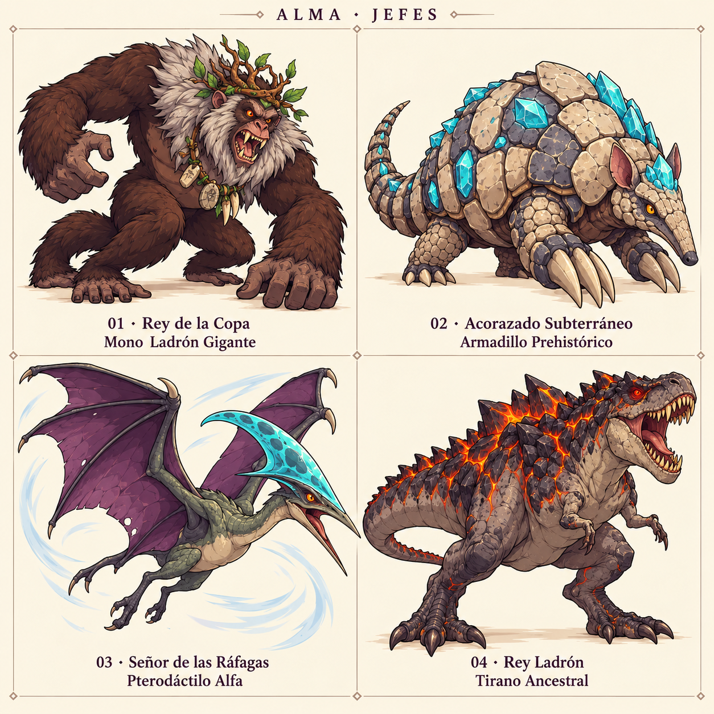

# Conceptos visuales de jefes — v1

Lámina creada con el generador integrado (`image_gen`), basada en el inventario y los documentos Boss_1, Boss_2, Boss_3 y Boss_Final. Usa la lámina de enemigos como referencia de estilo. Conceptos para revisión; no se han asignado a los prefabs.

| Mundo | Jefe | Prefab |
| --- | --- | --- |
| 1 | Rey de la Copa — Mono Ladrón Gigante | `Boss_GiantMonkey_Jungle.prefab` |
| 2 | Acorazado Subterráneo — Armadillo Prehistórico | `Boss_PrehistoricArmadillo_Caves.prefab` |
| 3 | Señor de las Ráfagas — Pterodáctilo Alfa | `Boss_AlphaPterodactyl_Swamp.prefab` |
| 4 | Rey Ladrón — Tirano Ancestral | `Boss_ThiefKing_Volcano.prefab` |

La lámina muestra propuestas de apariencia, no ventanas de vulnerabilidad. Los puntos débiles siguen las fases descritas en el inventario y sus controladores.

[Prompt de generación](Bosses_ConceptSheet_v1.prompt.txt).
