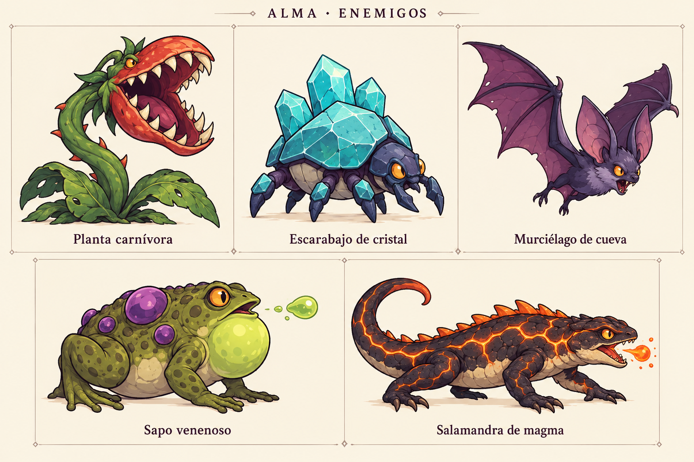

# Conceptos visuales de enemigos — v1

Lámina generada con el generador integrado (`image_gen`), basada en `INVENTARIO_GAMEPLAY_PREFABS.md`. Propuesta visual para revisar; no se ha asignado a los prefabs.



| Concepto | Prefab |
| --- | --- |
| Planta carnívora | `Plant_Carnivorous_Jungle.prefab` |
| Escarabajo de cristal | `Enemy_CrystalBeetle_Caves.prefab` |
| Murciélago de cueva | `Enemy_CaveBat_Caves.prefab` |
| Sapo venenoso | `Enemy_PoisonToad_Swamp.prefab` |
| Salamandra de magma | `Enemy_MagmaSalamander_Volcano.prefab` |

## Prompt de generación

```text
Use case: stylized-concept.
Create a clean concept-art inventory board for the 2D fantasy platformer ALMA: MOTHER'S ROAR showing EXACTLY FIVE enemies. Landscape canvas, warm ivory background, generous margins. Three evenly sized panels across the top row; two equally sized panels centered below. Delicate panel separators. Small title at top "ALMA · ENEMIGOS". Label each enemy below in clear Spanish text, exactly as given. Each creature is full body, entirely inside its panel, all wings, leaves and tails visible, oriented right in side or slight three-quarter view.
Consistent style across all five: simple hand-drawn 2D game art, appealing but dangerous prehistoric creatures, strong readable silhouettes, rounded stylized shapes, clean dark-plum outlines, limited colors and restrained cel shading. Concept thumbnails with enough detail to understand each creature, no scenery, no photorealism, no 3D render, no pixel art, no logos or watermarks, no extra characters.
Top row:
1. "Planta carnívora": a stationary jungle plant rooted with two broad leaves. Thick curved emerald stem, large hinged red-orange flower mouth with ivory triangular teeth, dark plum inside, small alert eyes. Open mouth in bite anticipation. Clearly rooted and immobile.
2. "Escarabajo de cristal": squat cave beetle, six short indigo legs, faceted turquoise crystalline shell with three chunky cyan crystals on its back, small amber eyes and modest mandibles. Low center of gravity, soft underside slightly visible; reads as a walking enemy that can be overturned.
3. "Murciélago de cueva": small indigo-violet bat, oversized pointed ears, amber eyes, broad plum membrane wings fully spread, compact furry body. Airborne forward-leaning pose suggests a swooping attack. Definitely a bat, not a dragon.
Bottom row:
4. "Sapo venenoso": squat moss-green swamp toad with a few large purple poison glands, ochre eyes, folded powerful hind legs, inflated lime throat sac. Faces right preparing to spit one small green poison bubble just in front of mouth. Body visually distinct from plant and beetle.
5. "Salamandra de magma": low elongated four-legged salamander with charcoal basalt skin, simple glowing orange fissures, cream underside, tapered curling tail, small orange dorsal ridge and amber eyes. Walking right with mouth slightly open and a small ember ready to spit. Four legs, no wings, no horns.
Keep equal illustration scale, consistent rendering quality and line weight, and readable Spanish labels.
```
