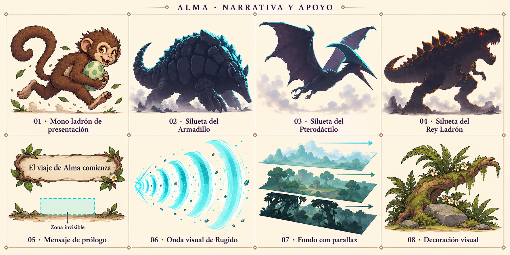

# Conceptos visuales de narrativa y apoyo — v1

Lámina creada con el generador integrado (`image_gen`), basada en el inventario. La lámina de jefes sirve de referencia de estilo y de siluetas para los guardianes. Conceptos para revisión; no se han asignado a los prefabs.

El prólogo y el parallax se muestran mediante esquemas explicativos. El texto del banner es una propuesta ilustrativa. La zona del trigger permanece invisible en el juego y las flechas de parallax no son sprites. La onda de Rugido representa únicamente su efecto visual. Las siluetas de guardianes anticipan los encuentros y no son jefes activos adicionales.

| Número | Elemento | Prefab |
| --- | --- | --- |
| 1 | Mono ladrón de presentación | `NPC_ThiefMonkeyTeaser_Jungle.prefab` |
| 2 | Silueta de guardián Armadillo | `Narrative_GuardianTeaser_Armadillo.prefab` |
| 3 | Silueta de guardián Pterodactyl | `Narrative_GuardianTeaser_Pterodactyl.prefab` |
| 4 | Silueta de guardián Thief_King | `Narrative_GuardianTeaser_Thief_King.prefab` |
| 5 | Mensaje de prólogo | `Narrative_PrologueTrigger_Universal.prefab` |
| 6 | Onda visual de Rugido | `VFX_RoarWave_Universal.prefab` |
| 7 | Fondo con parallax | `Scenery_ParallaxLayer_Universal.prefab` |
| 8 | Decoración visual | `Scenery_Decoration_Universal.prefab` |

[Prompt de generación](Narrative_ConceptSheet_v1.prompt.txt).
