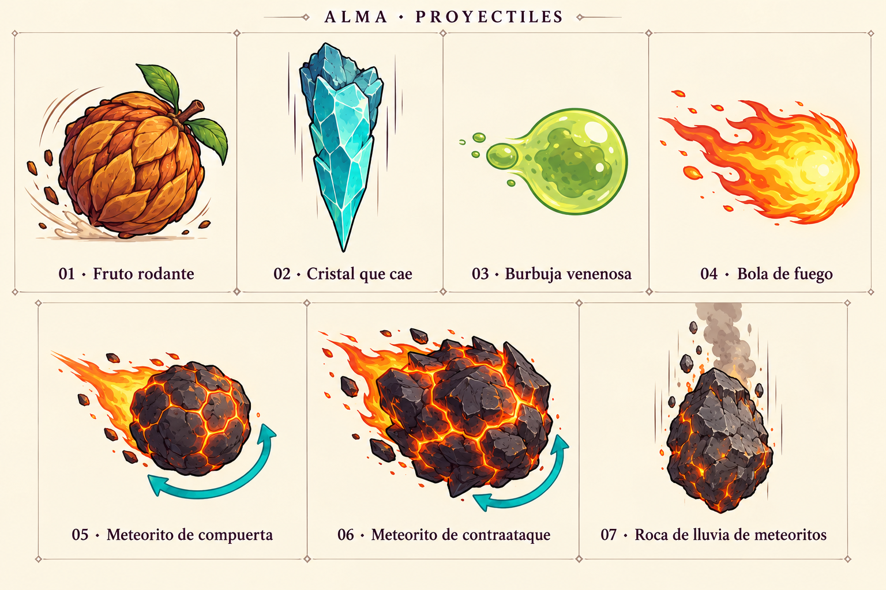

# Conceptos visuales de proyectiles — v1

Lámina creada con el generador integrado (`image_gen`), basada en el inventario de gameplay y en la lámina de enemigos como referencia visual. Conceptos para revisión; no se han asignado a los prefabs.

Las flechas turquesa indican los dos meteoritos que pueden devolverse con Rugido. Son anotaciones explicativas, no parte de los sprites. Las diferencias de forma y acabado entre meteoritos son propuestas visuales; no modifican sus mecánicas.

| Número | Proyectil | Prefab |
| --- | --- | --- |
| 1 | Fruto rodante | `Projectile_RollingFruit_Jungle.prefab` |
| 2 | Cristal que cae | `Projectile_FallingCrystal_Caves.prefab` |
| 3 | Burbuja venenosa | `Projectile_PoisonBubble_Swamp.prefab` |
| 4 | Bola de fuego | `Projectile_MagmaFireball_Volcano.prefab` |
| 5 | Meteorito reflejable de compuerta | `Projectile_ReflectableMeteor_Volcano.prefab` |
| 6 | Meteorito de contraataque final | `Projectile_CounterMeteor_FinalBoss.prefab` |
| 7 | Roca de lluvia de meteoritos | `Projectile_MeteorRainRock_FinalBoss.prefab` |

[Prompt de generación](Projectiles_ConceptSheet_v1.prompt.txt).
