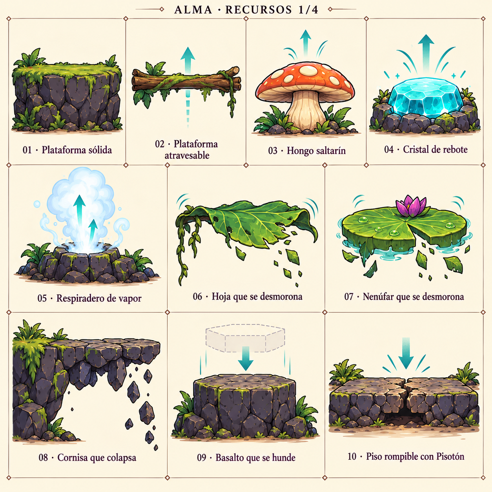
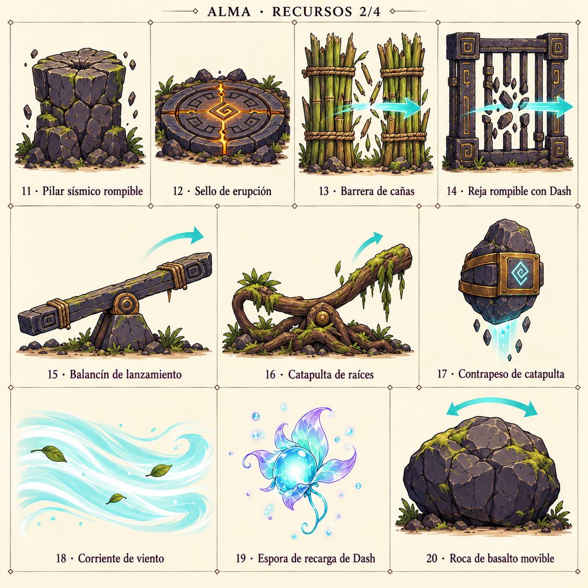
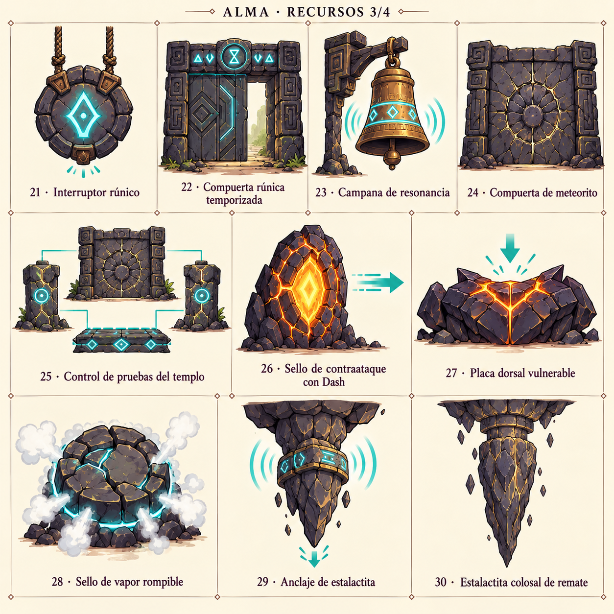
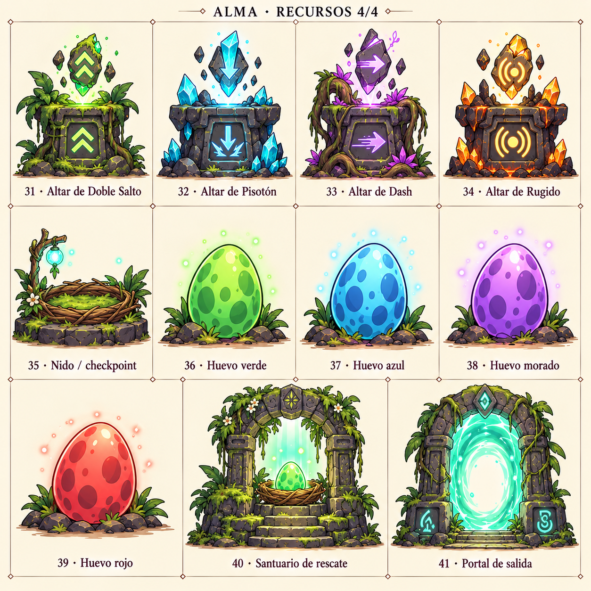

# Conceptos visuales de recursos — v1

Cuatro láminas generadas con el generador integrado (`image_gen`), siguiendo los 41 recursos del inventario en paquetes de 10, 10, 10 y 11. La lámina de trampas se usó únicamente como referencia de estilo. Son propuestas visuales para revisión; no se han asignado a los prefabs.

Las flechas y diagramas explican interacciones y no son parte de los sprites. Los colores y emblemas propuestos no modifican las mecánicas. El número 25 representa el conjunto controlado por las pruebas del templo, no un objeto adicional autónomo. Los sellos, la placa y el anclaje del jefe requieren las fases y conexiones de su encuentro.

## Lámina 1: recursos 1–10

[Prompt de generación](Resources_ConceptSheet_01_v1.prompt.txt).

| Número | Recurso | Prefab |
| --- | --- | --- |
| 1 | Plataforma sólida | `Platform_Solid_Universal.prefab` |
| 2 | Plataforma atravesable desde abajo | `Platform_OneWay_Universal.prefab` |
| 3 | Hongo saltarín | `Resource_BouncyMushroom_Jungle.prefab` |
| 4 | Cristal de rebote | `Resource_BouncyCrystal_Caves.prefab` |
| 5 | Respiradero de vapor de rebote | `Resource_SteamVent_Volcano.prefab` |
| 6 | Hoja que se desmorona | `Platform_CrumblingLeaf_Jungle.prefab` |
| 7 | Nenúfar que se desmorona | `Platform_CrumblingLilypad_Swamp.prefab` |
| 8 | Cornisa que colapsa | `Platform_CrumblingLedge_Volcano.prefab` |
| 9 | Basalto que se hunde | `Platform_SinkingBasalt_Volcano.prefab` |
| 10 | Piso rompible con Pisotón | `Resource_PoundBreakableFloor_Universal.prefab` |

## Lámina 2: recursos 11–20

[Prompt de generación](Resources_ConceptSheet_02_v1.prompt.txt).

| Número | Recurso | Prefab |
| --- | --- | --- |
| 11 | Pilar sísmico rompible | `Resource_SeismicPillar_Volcano.prefab` |
| 12 | Sello de erupción rompible | `Resource_EruptionSeal_Volcano.prefab` |
| 13 | Barrera de cañas rompible | `Resource_DashReedBarrier_Swamp.prefab` |
| 14 | Reja rompible con Dash | `Resource_DashTrialGrid_Volcano.prefab` |
| 15 | Balancín de lanzamiento | `Resource_SeesawCatapult_Caves.prefab` |
| 16 | Catapulta de raíces | `Resource_RootCatapult_Swamp.prefab` |
| 17 | Contrapeso de catapulta | `Resource_CatapultCounterweight_Caves.prefab` |
| 18 | Corriente de viento | `Resource_WindCurrent_Universal.prefab` |
| 19 | Espora de recarga de Dash | `Resource_DashRefillSpore_Swamp.prefab` |
| 20 | Roca de basalto movible | `Resource_RoarBoulder_Volcano.prefab` |

## Lámina 3: recursos 21–30

[Prompt de generación](Resources_ConceptSheet_03_v1.prompt.txt).

| Número | Recurso | Prefab |
| --- | --- | --- |
| 21 | Interruptor rúnico | `Resource_RuneSwitch_Caves.prefab` |
| 22 | Compuerta rúnica temporizada | `Resource_TimedRuneGate_Caves.prefab` |
| 23 | Campana de resonancia | `Resource_ResonanceBell_Volcano.prefab` |
| 24 | Compuerta de impacto de meteorito | `Resource_MeteorImpactGate_Volcano.prefab` |
| 25 | Control de pruebas del templo | `Resource_TempleTrialGate_Volcano.prefab` |
| 26 | Sello de contraataque con Dash | `Resource_DashHeatSeal_FinalBoss.prefab` |
| 27 | Placa dorsal vulnerable | `Resource_WeakDorsalPlate_FinalBoss.prefab` |
| 28 | Sello de vapor rompible | `Resource_SteamSeal_FinalBoss.prefab` |
| 29 | Anclaje de estalactita | `Resource_StalactiteAnchor_FinalBoss.prefab` |
| 30 | Estalactita colosal de remate | `Resource_ColossalStalactite_FinalBoss.prefab` |

## Lámina 4: recursos 31–41

[Prompt de generación](Resources_ConceptSheet_04_v1.prompt.txt).

| Número | Recurso | Prefab |
| --- | --- | --- |
| 31 | Altar de Doble Salto | `Resource_AbilityAltar_DoubleJump.prefab` |
| 32 | Altar de Pisotón | `Resource_AbilityAltar_GroundPound.prefab` |
| 33 | Altar de Dash | `Resource_AbilityAltar_AirDash.prefab` |
| 34 | Altar de Rugido | `Resource_AbilityAltar_Roar.prefab` |
| 35 | Nido / checkpoint | `Resource_CheckpointNest_Universal.prefab` |
| 36 | Huevo verde | `Resource_RescueEgg_Green.prefab` |
| 37 | Huevo azul | `Resource_RescueEgg_Blue.prefab` |
| 38 | Huevo morado | `Resource_RescueEgg_Purple.prefab` |
| 39 | Huevo rojo | `Resource_RescueEgg_Red.prefab` |
| 40 | Santuario de rescate | `Resource_EggSanctuary_Universal.prefab` |
| 41 | Portal de salida | `Resource_LevelExitPortal_Universal.prefab` |
