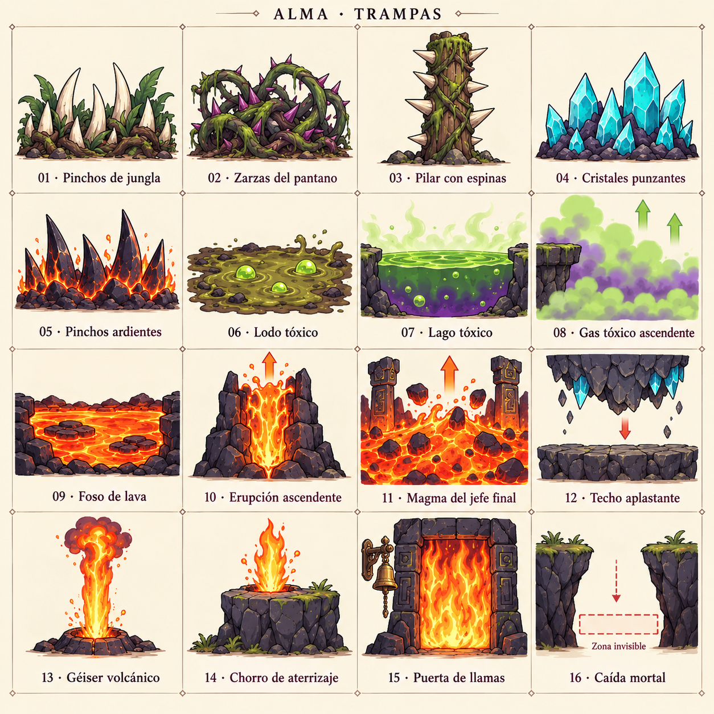

# Conceptos visuales de trampas — v1

Lámina creada con el generador integrado (`image_gen`), basada en el inventario de gameplay y en la lámina de enemigos como referencia visual. Conceptos para revisión; no se han asignado a los prefabs.

La zona de caída mortal se representa mediante un esquema: el volumen es invisible en el juego. Las flechas explican el movimiento y no son parte de los sprites. La campana junto a la puerta representa su mecanismo asociado, un recurso independiente.

| Número | Trampa | Prefab |
| --- | --- | --- |
| 1 | Pinchos de jungla | `Trap_Spikes_Jungle.prefab` |
| 2 | Zarzas del pantano | `Trap_Briers_Swamp.prefab` |
| 3 | Pilar con espinas | `Trap_SpikedPillar_Jungle.prefab` |
| 4 | Cristales punzantes y estalagmitas | `Trap_CrystalSpikes_Caves.prefab` |
| 5 | Pinchos ardientes | `Trap_BurningSpikes_Volcano.prefab` |
| 6 | Lodo tóxico | `Trap_ToxicMud_Swamp.prefab` |
| 7 | Lago tóxico | `Trap_ToxicLake_Swamp.prefab` |
| 8 | Gas tóxico ascendente | `Trap_RisingToxicGas_Swamp.prefab` |
| 9 | Río o foso de lava | `Trap_LavaPool_Volcano.prefab` |
| 10 | Erupción de lava ascendente | `Trap_RisingLavaEruption_Volcano.prefab` |
| 11 | Magma ascendente del jefe final | `Trap_RisingMagma_FinalBoss.prefab` |
| 12 | Techo aplastante | `Trap_CrushingCeiling_Caves.prefab` |
| 13 | Géiser volcánico peligroso | `Trap_FireGeyser_Volcano.prefab` |
| 14 | Chorro de fuego de aterrizaje | `Trap_LandingFlameJet_Volcano.prefab` |
| 15 | Puerta de llamas | `Trap_BellFlameDoor_Volcano.prefab` |
| 16 | Zona de caída mortal | `Trap_DeathZone_Universal.prefab` |
